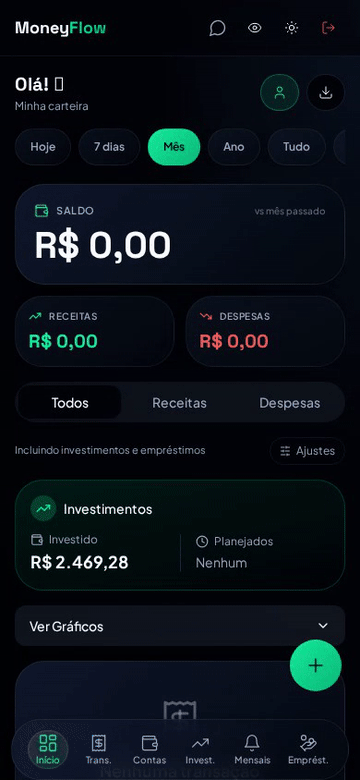
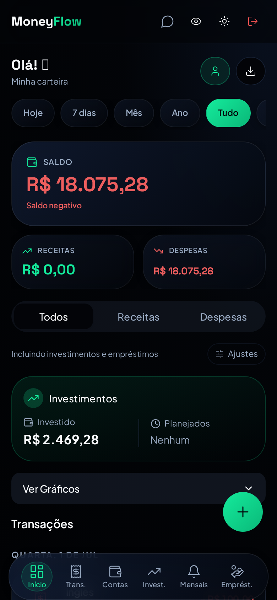
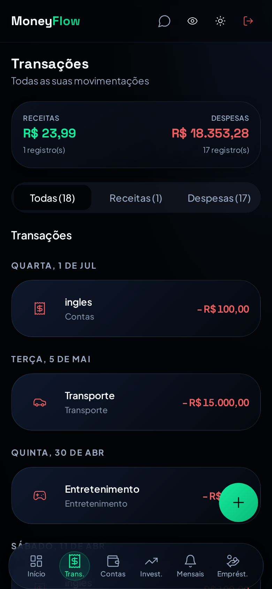
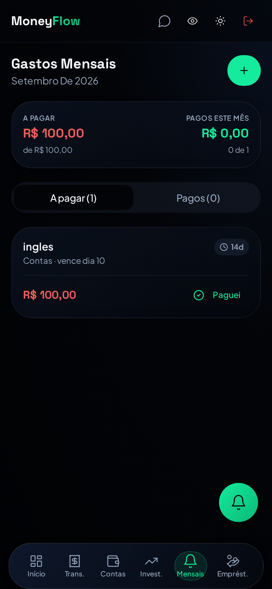
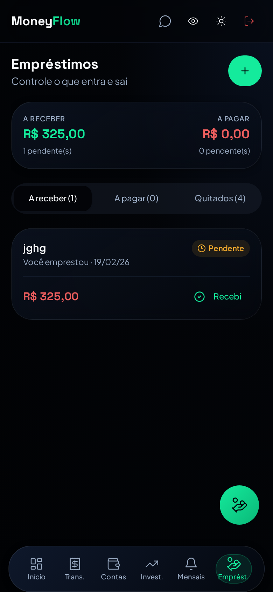
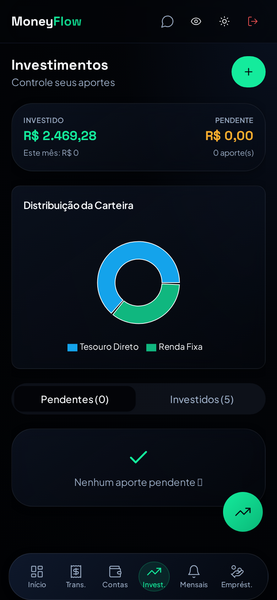
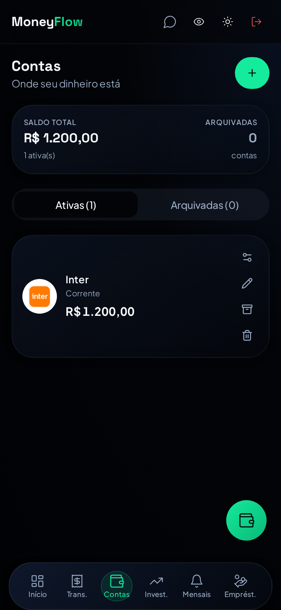
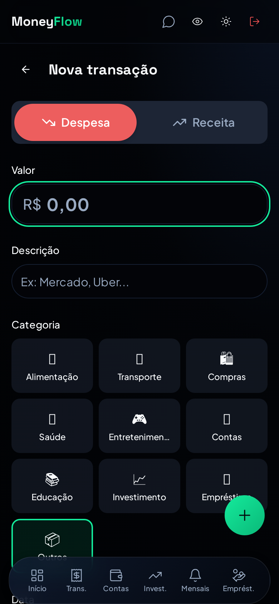
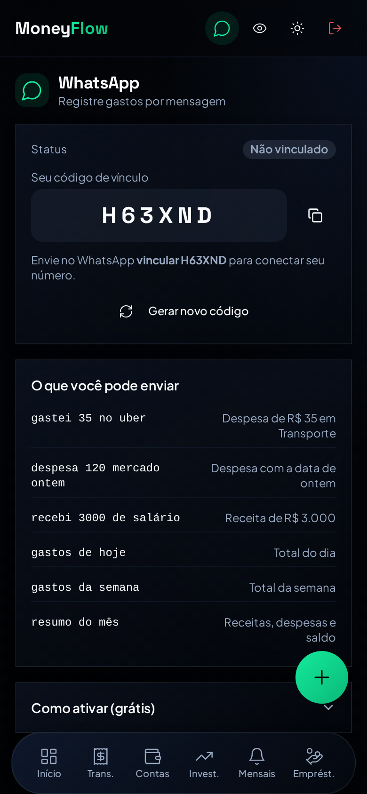

# 💰 MoneyFlow Pro

**MoneyFlow Pro** é um aplicativo web de **finanças pessoais**, construído 100% mobile-first como PWA. Desenvolvido inteiramente através de conversas com IA na plataforma [Lovable](https://lovable.dev), ele permite controlar receitas, despesas, gastos mensais recorrentes, empréstimos, investimentos e contas bancárias — tudo com sincronização em tempo real, modo casal e registro de gastos direto pelo WhatsApp.

<p align="center">
  
</p>

---

## 📱 O que é o app (resumo)

O MoneyFlow Pro nasceu para resolver um problema simples: **saber para onde o dinheiro está indo sem planilhas complicadas**. Ele oferece:

- **Painel (Dashboard)** — saldo, receitas e despesas do período com comparativo vs. mês anterior, gráfico de evolução semanal, despesas por categoria, lista de transações agrupadas por dia e exportação de relatórios em **PNG/PDF**.
- **Transações** — CRUD completo com categorias, descrição, data (calendário próprio em pt-BR) e vínculo com contas bancárias.
- **Registro Rápido com IA** — botão flutuante onde você digita em linguagem natural (`gastei 35 no uber`) e a IA interpreta valor, tipo, categoria e descrição.
- **Gastos Mensais** — contas recorrentes (aluguel, streaming, assinaturas…) com alerta antecipado configurável (ex.: 3 dias antes), marcação de "pago" que **gera automaticamente a despesa** no dashboard, abas *A pagar / Pagos* e histórico de quitação.
- **Empréstimos** — controle de valores *a receber* e *a pagar*, com **pagamentos parciais** (barra de progresso), quitação, edição completa e abas segmentadas.
- **Investimentos** — Tesouro Direto, Renda Fixa e outros, com valor investido, taxa, vencimento (date picker) e distribuição por tipo.
- **Contas Bancárias** — carteira manual por banco, com **logo real do banco** (ou ícone customizável) e ajuste de saldo.
- **Modo Casal (Carteira Compartilhada)** — convite por link, transações e saldos sincronizados **em tempo real** entre os dispositivos do casal, com segurança por linha (RLS) no banco.
- **WhatsApp gratuito** — vincule seu número e registre gastos/receitas e peça relatórios (`gastos da semana`, `resumo do mês`) por mensagem, sem custo, via Twilio Sandbox + IA.
- **PWA offline-first** — instalável no celular, funciona offline com fila de sincronização automática e atualização sem cache travado.
- **Modo privacidade** — oculta valores sensíveis com um toque (útil para mostrar a tela em público).
- **Design premium** — tema escuro navy com verde esmeralda, glassmorphism, navegação inferior flutuante, cards enxutos de 2 linhas e navegação leve com code-splitting.

---

## 🎥 Demonstração

| Dashboard | Transações | Gastos Mensais |
|---|---|---|
|  |  |  |

| Empréstimos | Investimentos | Contas |
|---|---|---|
|  |  |  |

| Nova transação | WhatsApp |
|---|---|
|  |  |

---

## 🤖 Interações com a IA (histórico de construção)

O app foi construído **sem escrever código manualmente** — cada funcionalidade abaixo foi entregue por um prompt conversado com a IA do Lovable, sempre exigindo preservação integral dos dados e funcionalidades já existentes:

| # | marco | pedido feito à IA (resumo) |
|---|---|---|
| 1 | **PRD inicial** (dez/2025) | Criação do app a partir de um PRD completo (ver seção abaixo) com Dashboard, transações, lembretes, empréstimos, registro rápido com IA e relatórios. |
| 2 | **Correção de datas** | Registros apareciam no menu de transações mas não no dashboard / com data errada — correção de conversão UTC → fuso local em todo o app. |
| 3 | **Lembretes → despesas** | Marcar um lembrete como pago deveria gerar automaticamente a despesa no dashboard e manter a recorrência. |
| 4 | **Redesign premium** | Visual inspirado em apps financeiros de alto nível (Pierre Finanças): dark navy + esmeralda, glassmorphism, tipografia premium. |
| 5 | **Comparação mensal** | Comparativo do período atual vs. anterior baseado em transações reais. |
| 6 | **Modo Casal** | Carteira compartilhada com convite via link, sincronização em tempo real e segurança de dados por RLS — sem perder nenhum registro antigo. |
| 7 | **Swipe-to-action** | Ações de editar/excluir escondidas por padrão, reveladas ao arrastar o card. |
| 8 | **Contas bancárias** | Cadastro manual de bancos com logo real (algo público) e edição de saldo. |
| 9 | **Pagamentos parciais** | Registrar parte do pagamento de um empréstimo e continuar acompanhando até quitar. |
| 10 | **Gastos Mensais recorrentes** | Alertas antecipados (ex.: 3 dias antes), marcar como pago por mês, histórico de quitados e recorrência automática. |
| 11 | **App mais leve** | Lazy loading por rota, layout padronizado (header → 2 métricas → abas → lista), menos sombras/animações no mobile. |
| 12 | **WhatsApp grátis** | Integração sem custo via Twilio Sandbox: registro por linguagem natural e relatórios por mensagem. |
| 13 | **Filtros e calendários** | Filtro de período personalizado (de–até) com calendário no dashboard e padronização de todos os calendários do app. |
| 14 | **Edição de empréstimos** | Editar todos os dados de um empréstimo existente. |

> Os prints e o GIF acima mostram o resultado final dessas interações.

---

## 📋 PRD — Prompt final do produto

> Este foi o PRD de origem do projeto (primeiro prompt), evoluído pelos prompts 2–14 acima até o estado atual do app.

```
Visão Geral da Aplicação: MoneyFlow Pro

MoneyFlow Pro é um aplicativo web para gerenciamento financeiro pessoal,
construído com React, Tailwind CSS e TypeScript. Ele permite que os usuários
acompanhem suas receitas, despesas, lembretes de contas e empréstimos,
oferecendo uma visão clara e organizada de suas finanças. O design é moderno,
responsivo e utiliza um sistema de tema claro/escuro.

1. Layout
   - Navegação responsiva: sidebar no desktop, barra inferior no mobile.
   - Tema claro/escuro persistido no localStorage.
   - FAB "+" sempre visível abrindo o Registro Rápido.
   - Informações do usuário logado e toasts de feedback.

2. Dashboard
   - Cards de resumo: receitas, despesas, saldo e total de transações.
   - Filtros por tipo, categoria e período (hoje, 7/30 dias, mês/ano atual).
   - Gráfico de pizza por categoria e gráfico de evolução semanal.
   - Lista de transações agrupadas por dia com edição e exclusão.
   - Exportação de relatório em PNG ou PDF.

3. Nova Transação
   - Registro/edição com tipo, categoria, valor, descrição e data.
   - Validação de valor > 0 e data preenchida, com toasts de feedback.

4. Lembretes
   - CRUD de contas recorrentes (mensais ou únicas) com valor, vencimento,
     categoria e status ativo.
   - Status de vencimento com cores (vencido, próximo, ok).

5. Empréstimos
   - Registro de empréstimos concedidos e recebidos.
   - Resumo de totais emprestados, a receber e pendentes.
   - Atualização de status (pendente, pago, recebido).

6. Registro Rápido (IA)
   - Entrada em linguagem natural (ex: "40 mercado", "+100 salário").
   - LLM interpreta valor, tipo, categoria e descrição e salva a transação.

7. Relatório
   - Filtro por receitas/despesas, resumo visual, top 5 categorias.
   - Exportação em PNG (html2canvas) e PDF (jsPDF).

Stack: React, Tailwind CSS, shadcn/ui, Lucide, date-fns, framer-motion,
recharts, html2canvas, jsPDF + backend com autenticação e banco de dados.
```

**Evolução consolidada do PRD (estado final):** além de tudo acima, o produto final inclui gastos mensais recorrentes com alertas antecipados e quitação mensal, empréstimos com pagamentos parciais e edição completa, investimentos (Tesouro Direto/Renda Fixa), contas bancárias com logos reais, modo casal com carteira compartilhada em tempo real, integração gratuita com WhatsApp, PWA offline-first com fila de sincronização, modo privacidade, filtros de período personalizados com calendário e design premium mobile-first.

---

## 🛠️ Tecnologias

- **Frontend:** React 18, TypeScript, Vite, Tailwind CSS, shadcn/ui, framer-motion, recharts, date-fns
- **Backend:** Lovable Cloud (Supabase) — Auth, banco PostgreSQL com RLS, Realtime e Edge Functions
- **IA:** Lovable AI Gateway (interpretação de linguagem natural no app e no WhatsApp)
- **WhatsApp:** Twilio Sandbox (gratuito) + Edge Function com TwiML
- **PWA:** vite-plugin-pwa (cache NetworkFirst, atualização automática)

## 🚀 Como rodar

```sh
npm install
npm run dev
```

Ou acesse a versão publicada: **https://flow-magic-buddy.lovable.app**
